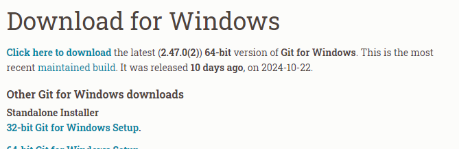

# GIT 
> Sistema de control de versiones

# pasos

# si es la primera vez que usamos git en una pc 
- Config el usuario

``` bash
git config --global user.name "Eze"
git config --global user.mail "ezequiel.messina@davinci.edu.ar"
```

- Iniciamos repositorio
``` bash
git init 
```

# ESTADOS 


- Agrego los archivos 
``` bash
git add README.md
```

- Creamos un commit 
``` bash
git commit -m "Proyecto Base"
```

-Para saber el estado del repo
``` bash
git status 
```

- CREAMOS CUENTA EN GITHUB - VINCULAMOS REPO
``` bash
git remote add origin https://github.com/emess9/pruebagithub.git
``` 

- Para subir los commits al repo a la nube uso 
``` bash
git push origin master 
``` 
